# Web Panel Demo Screenshots

This folder contains example screenshots of the repeater web panel.

The captures are demo-only and may show sample network/runtime values.

## 01. Main status view

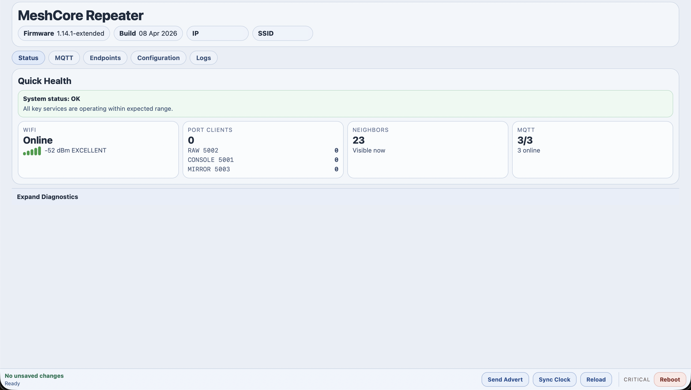

## 02. Extended runtime tables

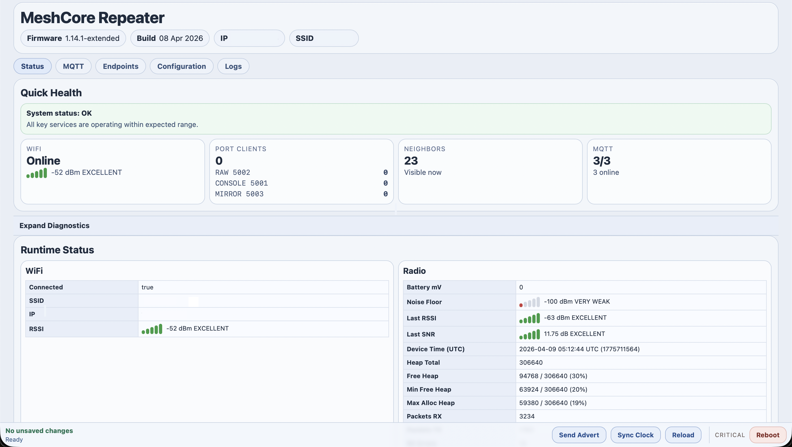

## 03. Neighbor list and map view

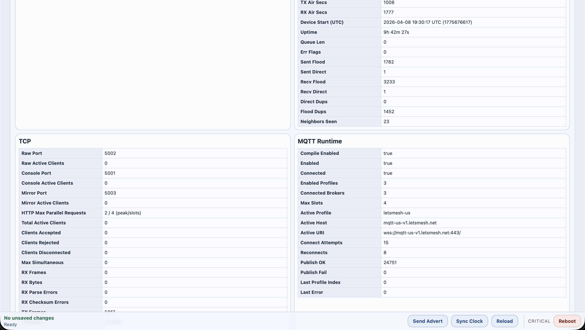

## 04. Configuration tab (identity and location)

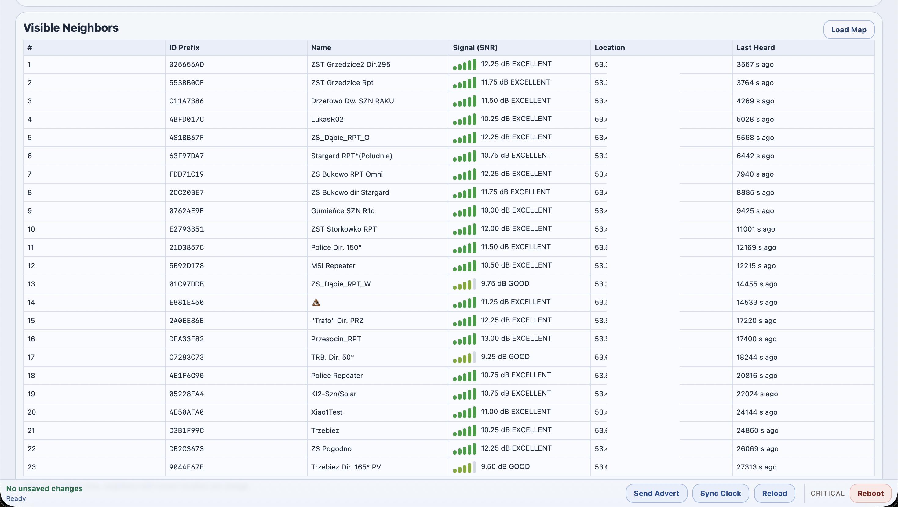

## 05. Configuration tab (radio section)

## 06. Configuration tab (advanced sections)

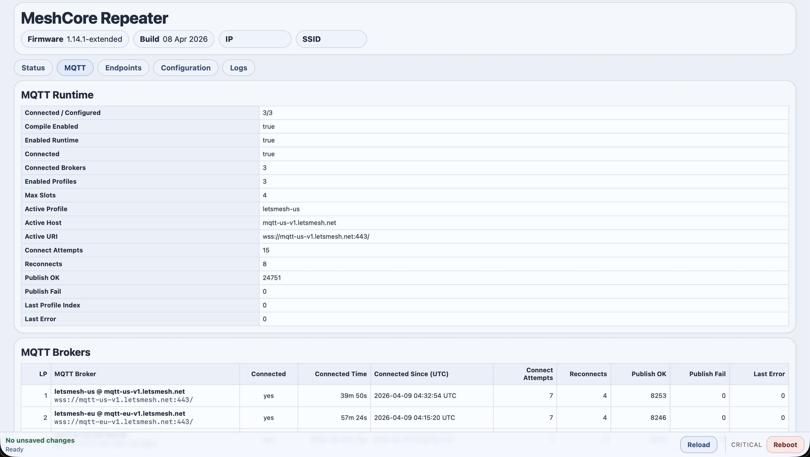

## 07. Configuration tab (MQTT section)

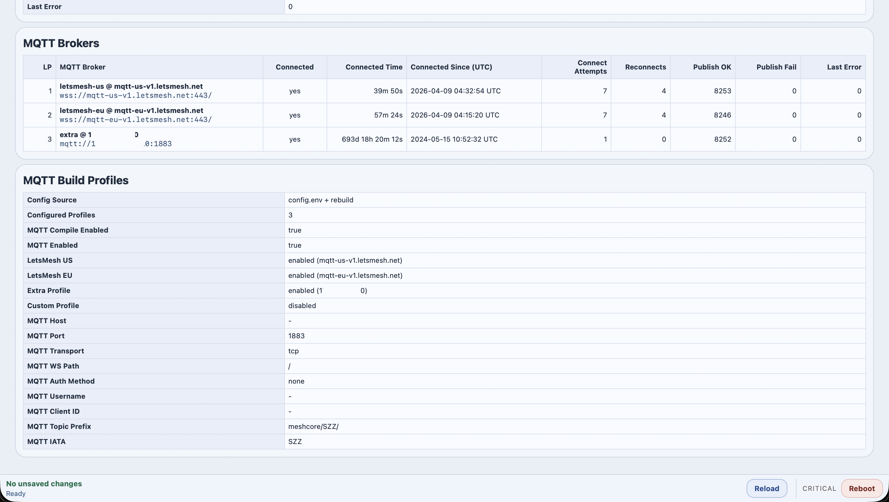

## 08. Logs tab (runtime events)

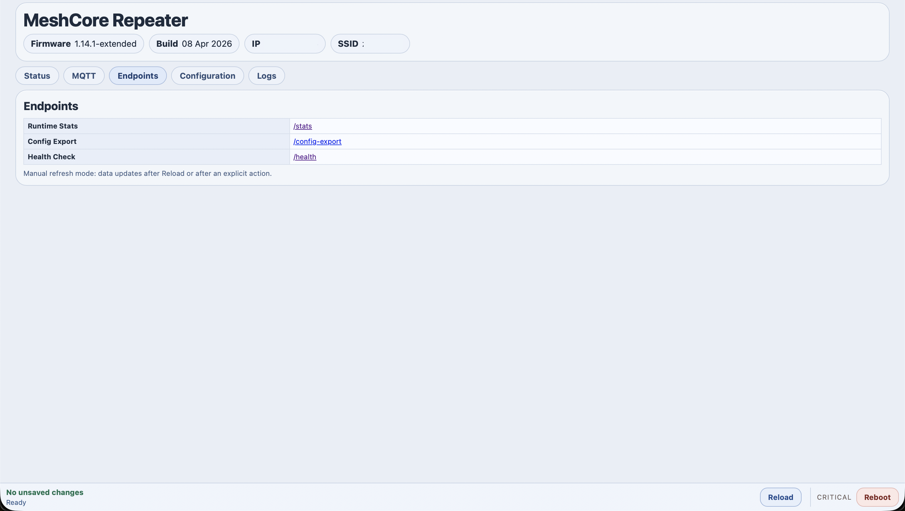

## 09. Alternate status snapshot

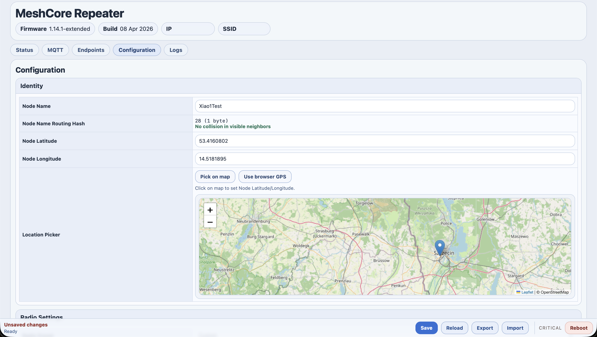

## 10. Alternate configuration snapshot

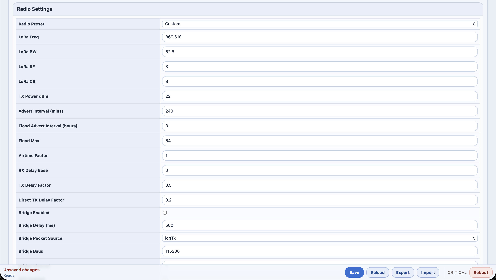

## 11. Alternate configuration details

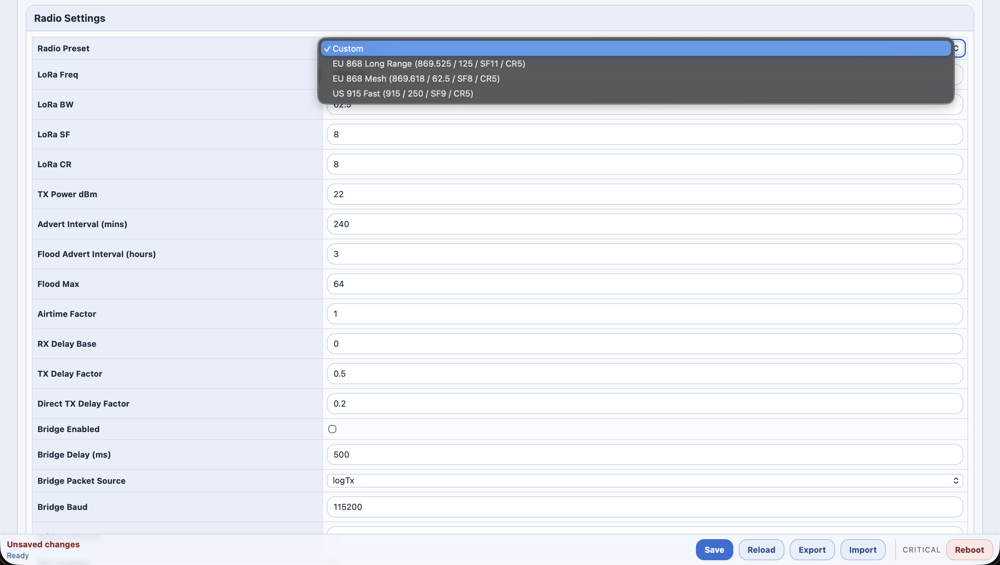

## 12. Alternate logs view

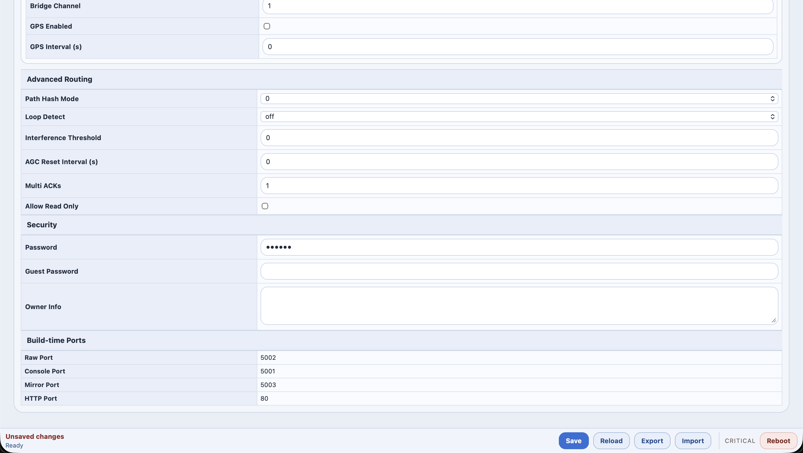

## 13. MQTT tab/table variant

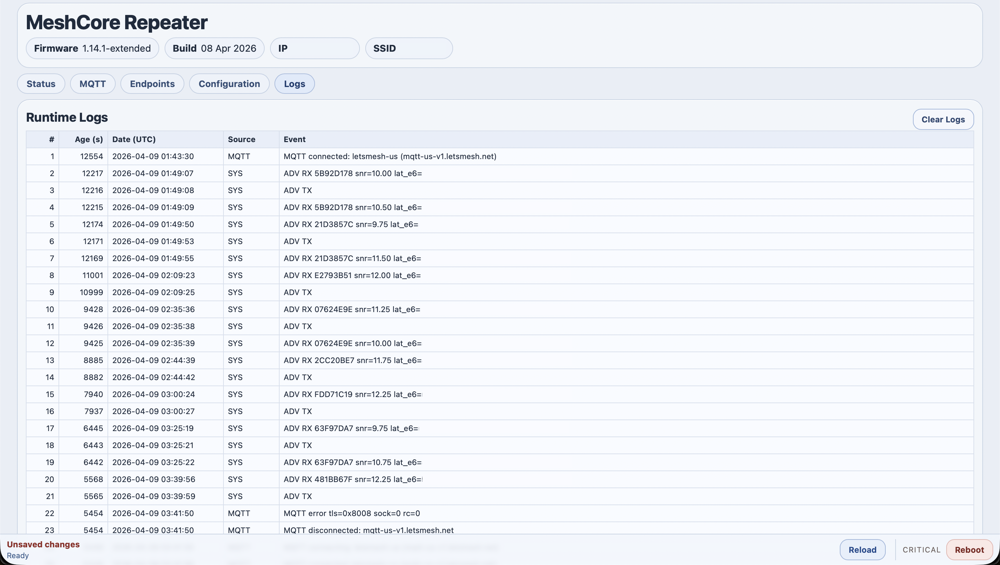

## 14. UI overview variant

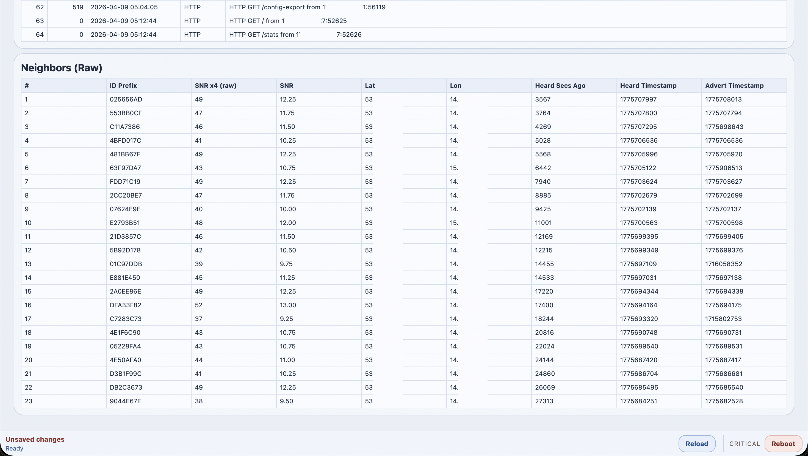
